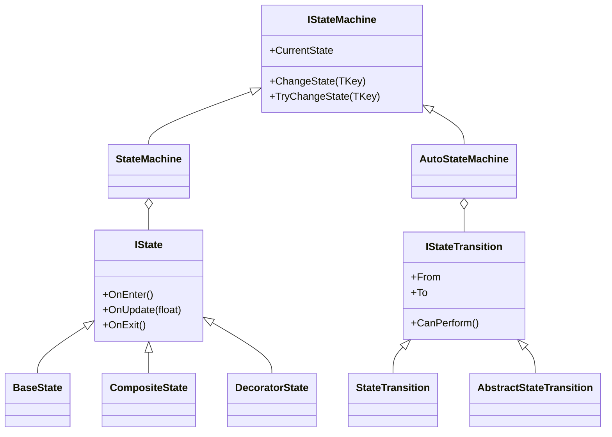

# 🧩 FSMModule — Finite State Machine Module

## 📖 Overview

**FSMModule** is a lightweight and extensible **Finite State Machine (FSM)** framework  
designed to manage system, object, AI, or UI behavior through a clean and modular architecture.

It’s written in pure C# — with no Unity dependencies — making it flexible and easy to integrate into any project.

---

## ⚙️ Project Architecture

```
FSMModule/
│
├── State/
│   ├── IState.cs
│   ├── BaseState.cs
│   ├── CompositeState.cs
│   └── DecoratorState.cs
│
├── Transition/
│   ├── IStateTransition.cs
│   ├── StateTransition.cs
│   └── AbstractStateTransition.cs
│
└── StateMachine/
    ├── IStateMachine.cs
    ├── StateMachine.cs
    ├── IAutoStateMachine.cs
    └── AutoStateMachine.cs
```

---

## 🔁 Logical FSM Flow

```mermaid
flowchart
TD
    A[State (IState)] --> B[Transition (IStateTransition)]
    B --> C[State Machine (StateMachine)]
    C --> D[Auto Machine (AutoStateMachine)]
    D -->|OnUpdate()| A
```

---

## 🧠 Core Interfaces

### `IState`
Base interface for all FSM states.

```csharp
void OnEnter();
void OnUpdate(float deltaTime);
void OnExit();
```

---

### `IStateTransition<TKey>`
Defines a state transition with an optional condition.

```csharp
TKey From { get; }
TKey To { get; }
bool CanPerform();
```

---

### `IStateMachine<TKey>`
Handles state registration and manual transitions.

```csharp
void ChangeState(TKey key);
bool TryChangeState(TKey key);
```

---

### `IAutoStateMachine<TKey>`
Extends `IStateMachine` to automatically change states when conditions are met.

```csharp
bool AddTransition(TKey from, TKey to, Func<bool> condition);
void OnUpdate(float deltaTime);
```

---

## 💡 Usage Example

```csharp
enum StateID { Idle, Run, Jump }

var fsm = new AutoStateMachine<StateID>(
    StateID.Idle,
    new[]
    {
        (StateID.Idle, new BaseState(onUpdate: dt => Debug.Log("Idle"))),
        (StateID.Run, new BaseState(onUpdate: dt => Debug.Log("Run"))),
        (StateID.Jump, new BaseState(onUpdate: dt => Debug.Log("Jump")))
    },
    new[]
    {
        new StateTransition<StateID>(StateID.Idle, StateID.Run, () => Input.GetKey(KeyCode.W)),
        new StateTransition<StateID>(StateID.Run, StateID.Idle, () => !Input.GetKey(KeyCode.W)),
        new StateTransition<StateID>(StateID.Run, StateID.Jump, () => Input.GetKeyDown(KeyCode.Space))
    }
);
```

FSM automatically changes states when transition conditions are satisfied in `OnUpdate()`.

---

## 🧩 Class Architecture Diagram



---

## ✅ Advantages

- Pure C# — no external dependencies  
- Simple and intuitive API  
- Easily extensible through composition and decorators  
- Built-in automatic transitions  
- Works with Unity, backend systems, or console apps

---

## 🧩 Possible Extensions

- State history (Stack FSM)  
- Asynchronous states (using `Task` or `UniTask`)  
- Visual FSM editor integration  
- Logging and transition debugging  
- Event-driven transitions  
- Integration with Behavior Trees or AI Graphs  

---

## 📄 License
MIT License © 2025
