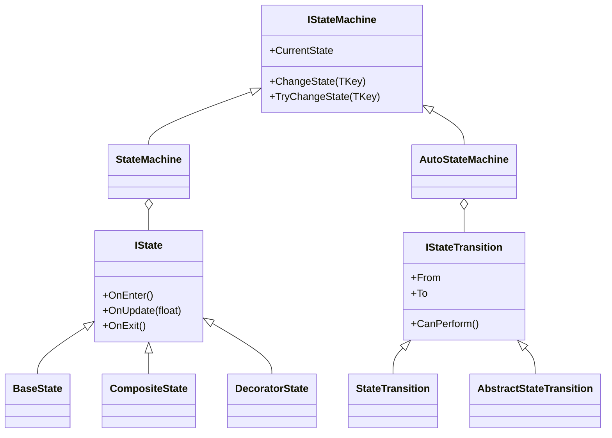

# 🧩 FSMModule — Модуль конечного автомата (Finite State Machine)

## 📖 Обзор

**FSMModule** — это лёгкий и расширяемый модуль конечного автомата (Finite State Machine, FSM),  
предназначенный для управления поведением систем, объектов, AI, UI и любых других сценариев, где важно отслеживать состояния и переходы между ними.

Модуль написан на чистом C# и не зависит от Unity, что делает его универсальным и простым для интеграции.

---

## ⚙️ Архитектура проекта

```
FSMModule/
│
├── State/
│   ├── IState.cs
│   ├── BaseState.cs
│   ├── CompositeState.cs
│   └── DecoratorState.cs
│
├── Transition/
│   ├── IStateTransition.cs
│   ├── StateTransition.cs
│   └── AbstractStateTransition.cs
│
└── StateMachine/
    ├── IStateMachine.cs
    ├── StateMachine.cs
    ├── IAutoStateMachine.cs
    └── AutoStateMachine.cs
```

---

## 🔁 Логическая схема работы FSM

```mermaid
flowchart LR
    A[Состояние (IState)] --> B[Переход (IStateTransition)]
    B --> C[Машина состояний (StateMachine)]
    C --> D[Автоматическая машина (AutoStateMachine)]
    D -->|OnUpdate()| A
```

---

## 🧠 Основные интерфейсы

### `IState`
Базовый контракт для всех состояний.

```csharp
void OnEnter();
void OnUpdate(float deltaTime);
void OnExit();
```

---

### `IStateTransition<TKey>`
Определяет переход между двумя состояниями.

```csharp
TKey From { get; }
TKey To { get; }
bool CanPerform();
```

---

### `IStateMachine<TKey>`
Управляет текущим состоянием и обработкой событий смены состояния.

```csharp
void ChangeState(TKey key);
bool TryChangeState(TKey key);
```

---

### `IAutoStateMachine<TKey>`
Расширяет `IStateMachine`, добавляя автоматические переходы при выполнении условий.

```csharp
bool AddTransition(TKey from, TKey to, Func<bool> condition);
void OnUpdate(float deltaTime);
```

---

## 💡 Примеры использования

### Простая машина состояний
```csharp
enum StateID { Idle, Run }

var fsm = new StateMachine<StateID>(
    StateID.Idle,
    new[]
    {
        (StateID.Idle, new BaseState(onUpdate: dt => Debug.Log("Idle"))),
        (StateID.Run, new BaseState(onUpdate: dt => Debug.Log("Run")))
    }
);

fsm.ChangeState(StateID.Run);
```

---

### Автоматическая машина состояний
```csharp
enum StateID { Idle, Run, Jump }

var fsm = new AutoStateMachine<StateID>(
    StateID.Idle,
    new[]
    {
        (StateID.Idle, new BaseState(onUpdate: dt => Debug.Log("Idle"))),
        (StateID.Run, new BaseState(onUpdate: dt => Debug.Log("Run"))),
        (StateID.Jump, new BaseState(onUpdate: dt => Debug.Log("Jump")))
    },
    new[]
    {
        new StateTransition<StateID>(StateID.Idle, StateID.Run, () => Input.GetKey(KeyCode.W)),
        new StateTransition<StateID>(StateID.Run, StateID.Idle, () => !Input.GetKey(KeyCode.W)),
        new StateTransition<StateID>(StateID.Run, StateID.Jump, () => Input.GetKeyDown(KeyCode.Space))
    }
);
```

FSM автоматически переключает состояния при выполнении условий в `OnUpdate()`.

---

## 🧩 Архитектурная схема классов



---

## ✅ Преимущества

- Минимальные зависимости — чистый C#  
- Простая архитектура и понятный API  
- Расширяемость через композицию и декораторы  
- Поддержка автоматических переходов  
- Легко интегрируется с Unity, серверной логикой или консольными приложениями

---

## 📄 Лицензия
MIT License © 2025
